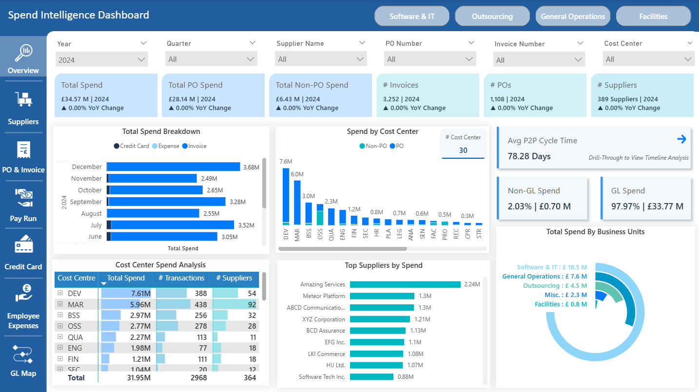
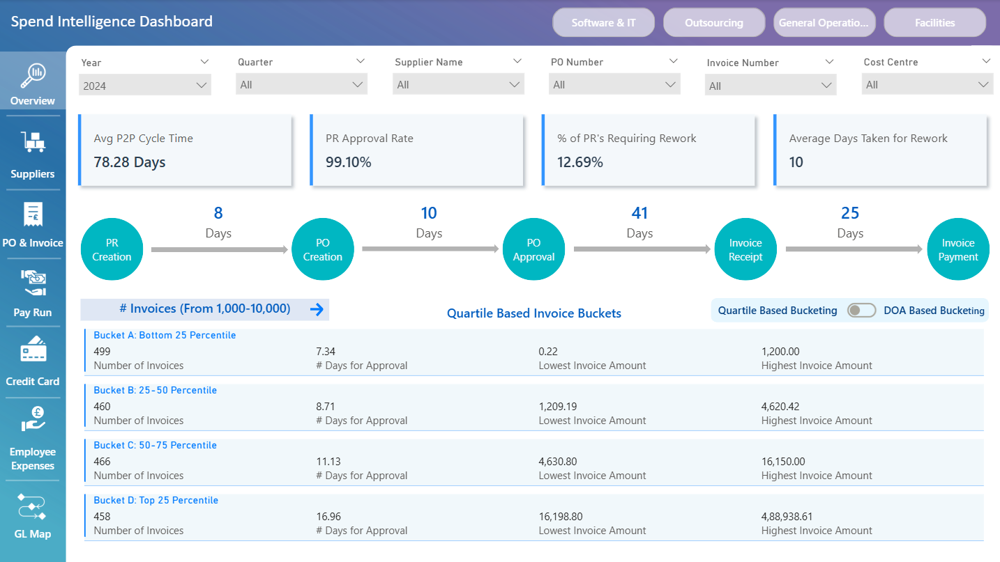
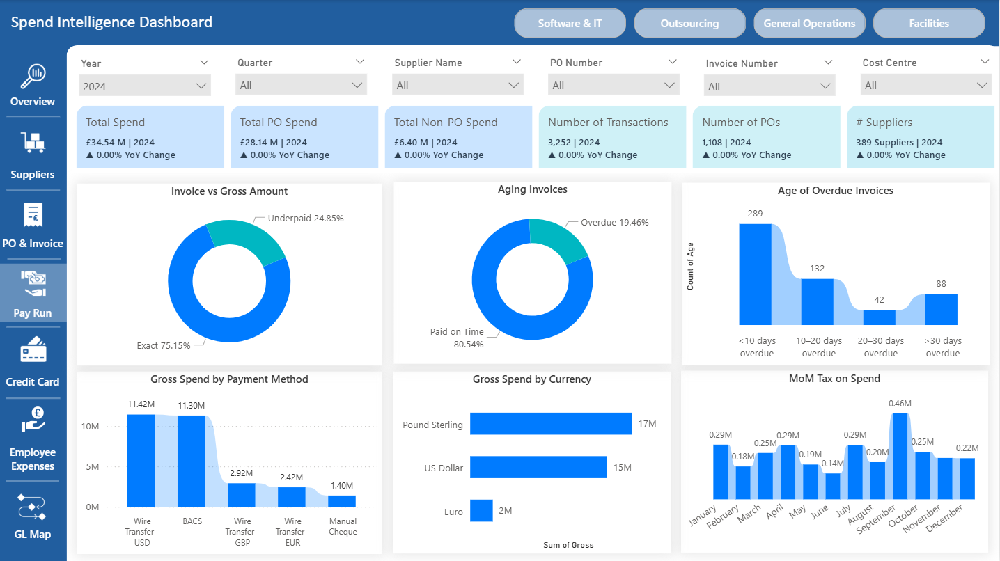
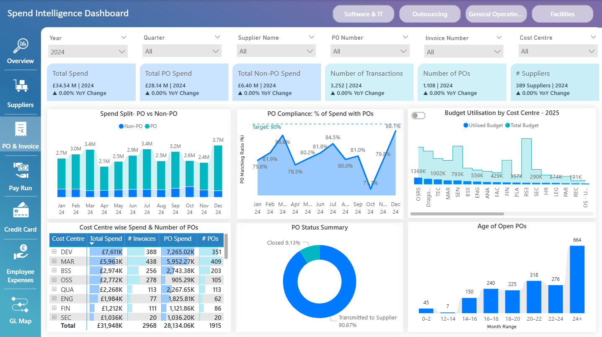
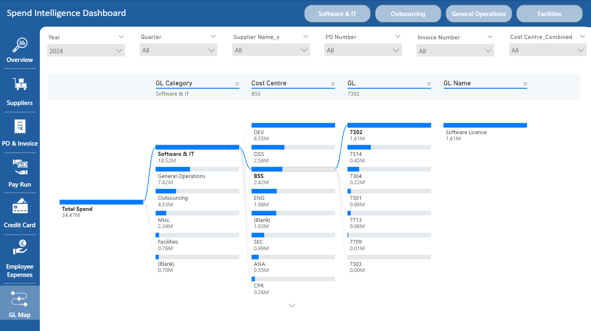

# Spend Intelligence & P2P Analytics Dashboard (Power BI)

## Overview

Designed and developed a multi-page Power BI dashboard providing end-to-end visibility into procurement spend and Procure-to-Pay (P2P) performance.

The dashboard enables stakeholders to:
- Monitor total spend and PO vs Non-PO split
- Track PO compliance against target
- Identify long P2P cycle time stages
- Detect aging POs and overdue invoices
- Analyze spend by supplier, cost centre, GL, and category

---

## 01 — Executive Overview (Spend & KPI Summary)

High-level executive dashboard summarizing:
- Total Spend, PO Spend, Non-PO Spend
- Number of POs, Suppliers, Transactions
- Spend breakdown by month and cost centre
- Supplier concentration analysis

---

## 02 — P2P Lifecycle & Cycle Time Analysis

Process-stage visualization of:
PR Creation → PO Creation → PO Approval → Invoice Receipt → Invoice Payment

Key KPIs:
- Avg P2P Cycle Time
- PR Approval Rate
- % Rework
- Days per stage

Used to identify bottlenecks and delay drivers.

---

## 03 — Invoice & Payment Analysis

Provides visibility into:
- Invoice vs Gross variance
- Aging invoices (paid vs overdue)
- Overdue distribution buckets
- Spend by payment method and currency
- Month-over-Month tax impact

Enables working capital and payment risk analysis.

---

## 04 — PO Compliance & Budget Utilisation

Tracks:
- PO vs Non-PO monthly trend
- PO Compliance % against 90% target
- Cost centre-level budget utilisation
- PO status summary
- Age of open POs

Highlights governance gaps and compliance risks.

---

## 05 — GL & Cost Centre Drill-Down (Data Lineage View)

Hierarchical spend flow:
Total Spend → Business Unit → Cost Centre → GL Code → GL Name

Enables granular traceability of spend drivers.

---

## Technical Implementation

- Power BI
- DAX measures (Compliance %, Aging Buckets, Cycle Time, Variance)
- Star Schema Data Modeling
- KPI Framework Design
- Drill-through & Cross-filtering
- Dynamic slicers

---

## Business Impact

The dashboard framework enabled:
- Identification of low PO compliance
- Detection of extended P2P cycle time
- Prioritization of long-aging POs
- Improved spend governance visibility

(Data anonymized for confidentiality.)
